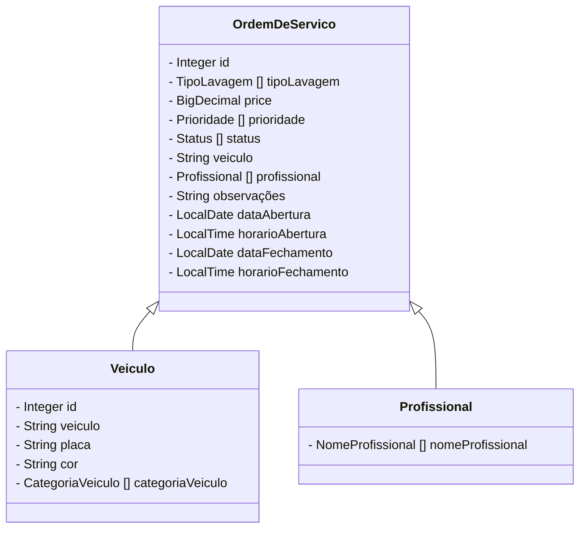

# CAS WASH 💦🚗  Controle Gerencial de Lava Rápido
Back-End em Java contendo a parte lógica com RESTful API aplicado as regras de negócio e requisições.

## Principais Tecnologias
 - **Java 17**: Utilizada versão LTS mais recente do Java;
 - **Spring Boot 3**: Utilizada versão 2.3.12 do Spring Boot;
 - **Spring Data JPA**: Integração com bancos de dados SQL;
 - **Maven**: Gerenciamento para o projeto

## Diagrama de Classes (Entidades)

## Regra de Negócio

- **LAVAGEM SIMPLES**: é um processo de lavagem mais rápida, onde prioriza a lataria do carro. O interior é aspirado e os pneus ganham atenção também, porém o motor fica de fora.
- **LAVAGEM SIMPLES + CERA**: neste caso a lavagem simples ganha uma enceramento para um maior brilho do veículo além de uma película protetora.
- **LAVAGEM COMPLETA**: além dos itens da lavagem simples, o motor e a parte de baixo do veículo é lavado também. 
- **LAVAGEM + CERA**: é o processo de lavagem completa junto com o enceramento do veículo, criando maior brilho e protegendo a pintura e com um valor mais acessível do que o polimento e outros processos para a proteção da lataria.
- **LAVAGEM + POLIMENTO**: é feito a lavagem completa e feito um polimento na lataria do veículo.
